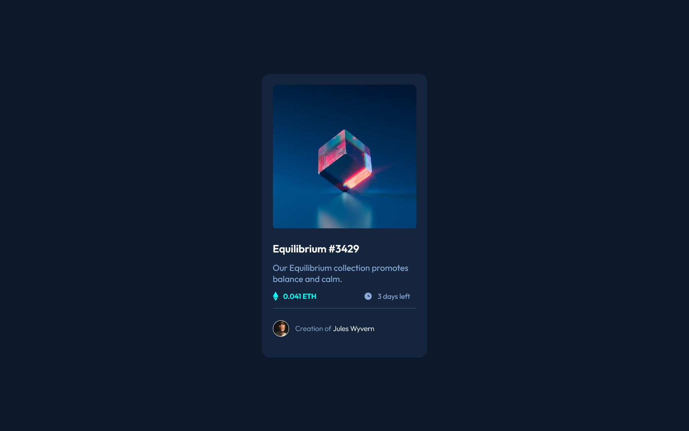

# Frontend Mentor - NFT preview card component solution

This is a solution to the [NFT preview card component challenge on Frontend Mentor](https://www.frontendmentor.io/challenges/nft-preview-card-component-SbdUL_w0U). Frontend Mentor challenges help you improve your coding skills by building realistic projects. 

## Table of contents

- [Overview](#overview)
  - [Screenshot](#screenshot)
  - [Links](#links)
- [My process](#my-process)
  - [Built with](#built-with)
  - [What I learned](#what-i-learned)
  - [Continued development](#continued-development)
  - [Useful resources](#useful-resources)
- [Author](#author)
- [Acknowledgments](#acknowledgments)

## Overview

### Screenshot




### Links

- Solution URL: [Add solution URL here](https://github.com/MariaCMontO/nft-card-cmo)

## My process

### Built with

- Semantic HTML5 markup
- CSS custom properties
- Flexbox

### What I learned

With this project I learned how to include sass, and use tools like: prettier and Stylelint. I learned how to configure it and use it.

```css
$Blue-500-border: hsl(215deg 52% 70% / 43.4%);
$Blue-500: hsl(215deg 51% 70%);
$Cyan-400: hsl(178deg 100% 50%);
$Blue-950: hsl(217deg 54% 11%); // (main BG)
$Blue-900: hsl(216deg 50% 16%); // (card BG)
$Blue-800: hsl(215deg 32% 27%); // (line)
$White: hsl(0deg 0% 100%);

 &__overlay {
    position: absolute;
    top: 0;
    width: 100%;
    height: 100%;
    background-color: $Cyan-400;
    opacity: 0;
    display: flex;
    justify-content: center;
    align-items: center;
    cursor: pointer;

    &:hover {
      opacity: 0.6;
    }
  }
```

### Continued development

I definitely want to keep developing interfaces using the rem unit - it makes many task much easier. However, I also want to improve my understanding about paddings and margins to become a more practical and efficient developer. 

### Useful resources

## Author

- Frontend Mentor - [@MariaCMontO](https://github.com/MariaCMontO)


## Acknowledgments
